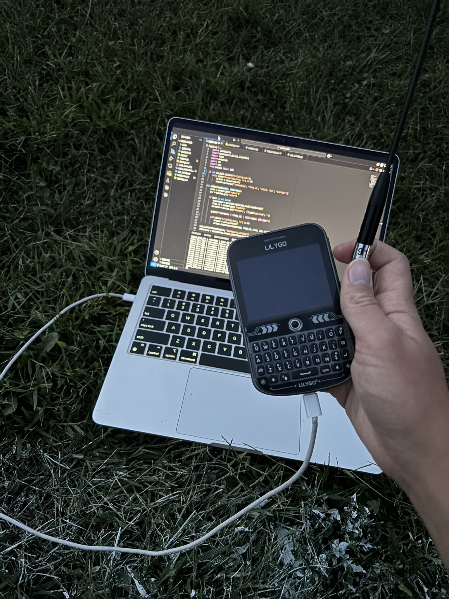
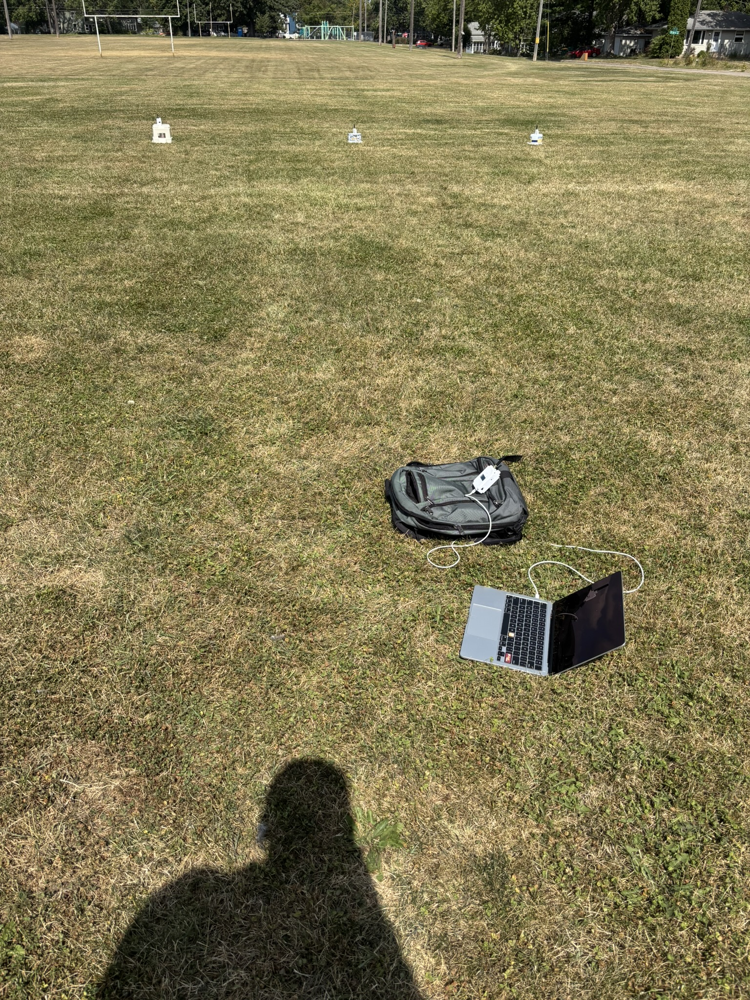
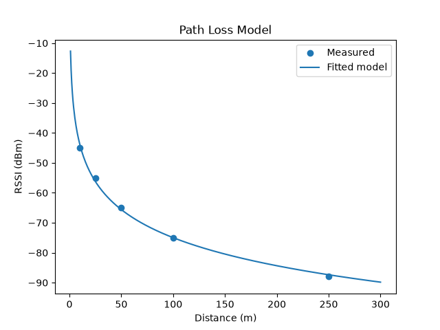
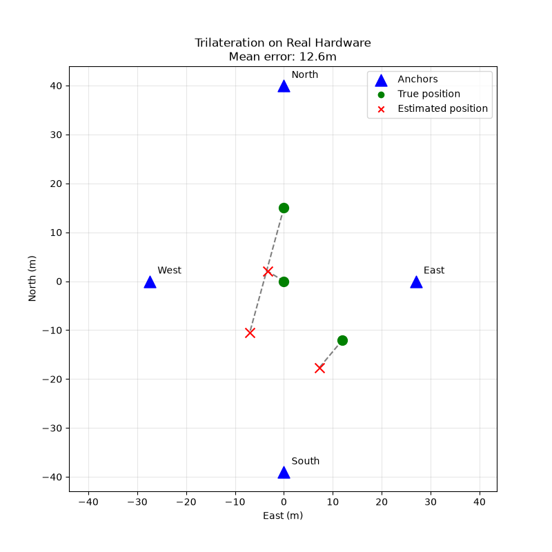
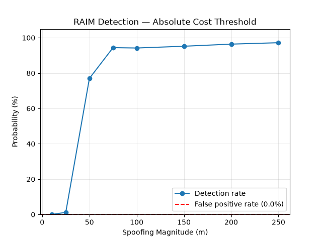
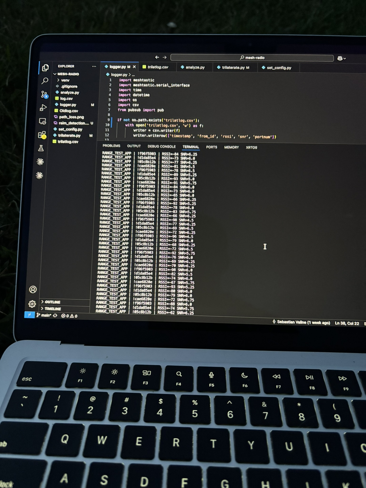

# GPS-Denied Localization & Spoofing Detection over LoRa Mesh

I built a 5-node LoRa mesh that can figure out where a node is without GPS, just using signal strength between radios. Then I made it detect when one of the nodes is lying about its own position. It's basically RAIM (Receiver Autonomous Integrity Monitoring), the same integrity check aviation GPS uses, except running on a $30 mesh radio instead of a satellite receiver.

## What it actually does

The locations of four fixed radios are known, and serve as anchors. A fifth radio has GPS disabled and location unknown, and serves as the rover. It listens to how strong each anchor's signal is, turns that into a distance estimate using a model I made using field RSSI measurements, and solves for its own position from those distances.

The spoofing detection works by testing every possible group of 3 anchors out of the 4. If all four groups agree on roughly the same position, everyone'slikely telling the truth. If one anchor is lying about where it actually is, any group that includes that anchor gets a distorted answer, while the one group that happens to exclude the liar stays accurate. That mismatch is how you catch the spoofer.

The tricky part is deciding how far off is too far off before you actually call it spoofing, since RSSI measurements are noisy even if all anchors are honest. My first attempt compared the ratio of the best group's cost to the second best group's cost, but that causes a very high rate of false positives since small honest measurement noise can still produce a big ratio between two small numbers. The solution that worked was comparing each group's cost against the noise level I measured in the field. A group counts as clean only if its cost is close to what you'd expect from noise alone, and every other group has to be clearly worse than that in order to flag as a spoofing event. That version of the algorithm came back with zero false positives across 500 simulated trials while still reliably catching spoofing at 50 meters and beyond and is what I used for my field trial.

## Results

I placed radios at six different distances, from 10 to 160 meters, and logged signal strength at each one. I fit a log-distance path loss model to that data to give me a way to convert RSSI into a distance estimate. The model is accurate to about 12% mean error across that whole range.

Using that model, I ran a field trilateration test with 4 anchors spaced in a diamond about 40 meters apart, and a rover (the T-Deck radio) I moved to three different spots. The mean position error came out to 12.6 meters. The center position, which I verified with a rangefinder, landed at 3.8 meters. I also used a rangefinder to determine where i was for locations 2 and 3, but there is a certain amount of error in those measurements especially considering I was shooting a small bucket with a radio on top

For the spoofing test, I took RSSI data from the anchors and told the algorithm one of them was somewhere it wasn't, at four different lie sizes. It correctly flagged no liars when all locations were real, missed a 25 meter lie (which is inside the noise floor of the RSSI measurements, so that checks out), and caught all spoofs of 50 meters plus.

| Lie distance | Result |
|---|---|
| 0m (honest) | Correctly flagged nothing |
| 25m | Missed, inside the noise floor |
| 50m | Detected |
| 100m | Detected |
| 200m | Detected |

RAIM spoofing detection correctly identifies a compromised anchor at 50m, 100m, and 200m lie magnitudes, using real RSSI measurements and a detection threshold that gives a 0% false positive rate on honest anchors across 500 simulated trials.

## Hardware

- 2x LILYGO T-Echo
- 2x RAK WisMesh Pocket
- 1x LILYGO T-Deck Plus, running as the rover

Everything's built around SX1262 LoRa radios, either on nRF52840 or ESP32-S3 boards, all running Meshtastic firmware 2.7.22 at 915 MHz on the LONG_FAST preset. All the actual logic runs as a Python script on my laptop, talking to whichever radio is plugged in over USB serial.

## How the code works

`logger.py` connects to a LoRa radio over serial and subscribes to incoming packets through the Meshtastic Python API. Every time a packet comes in with signal strength and signal to noise info attached, it gets written to a CSV.

`analyze.py` reads the calibration data, averages RSSI at each distance, fits the path loss model with scipy's curve_fit, and plots the result.

`trilaterate.py` has the trilateration solver, which uses scipy's minimize function to find the position that best matches a set of range estimates. No linear algebra needed, just nonlinear least squares on the sum of squared range errors. This file also has the RAIM logic and runs a Monte Carlo sweep across different spoofing magnitudes, using the noise level logged in the field, to build the detection probability curve, and produces most of the plots in this readme using matplotlib.

`process_field.py` is where it all comes together on real data. It reads the field log, turns RSSI into range estimates, runs trilateration, and runs RAIM with the same detection threshold that was validated in simulation.

## Stuff that went wrong

Meshtastic firmware 2.7.26 has a bug where the position broadcast interval doesn't persist after reboots on nRF52 boards. I spent a long time struggling with this and eventually downgraded to 2.7.22 which fixed this issue.

During this process I unfortunately bricked one of the Pockets by flashing the wrong bootloader erase file. I turned a Raspberry Pi Pico into makeshift SWD programmer, which allowed me to flash the correct bootloader and then firmware back on, but that was an adventure.

My first version of the RAIM detector used a ratio between the best and second best subset cost. It looked fine on paper and even worked on my one real field trial, but when I actually ran it through a few hundred simulated trials, it flagged honest anchors as spoofers something like 20 to 70 percent of the time depending on the threshold. Switched to an absolute cost threshold based on the actual measured noise level instead, which fixed it completely, zero false positives across 500 trials.

RSSI is very noisy. I measured 5 to 9 dB of standard deviation at every distance I tested, which limits the accuracy of this kind of ranging. The next step up is time of flight or UWB ranging instead.

## What's next

- Extend the logger to also parse lat/lon out of position broadcasts, so the spoofing test can be run fully over the mesh instead of substituting the spoofed coordinate in code
- Add a Kalman filter for the rover position once I have a little more linear algebra
- Innovation gating to reject bad range measurements automatically
- Detecting a slow drift attack, where the spoof creeps in gradually instead of jumping all at once
- A live dashboard instead of static plots

## Data

The `data/` folder has the raw CSVs from both field sessions. 